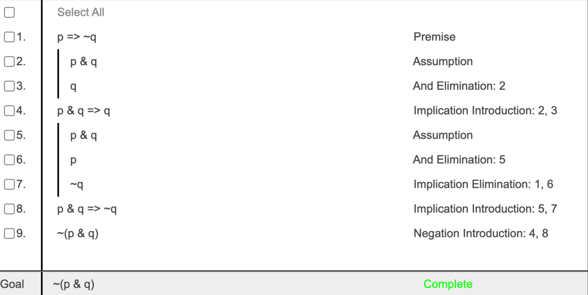
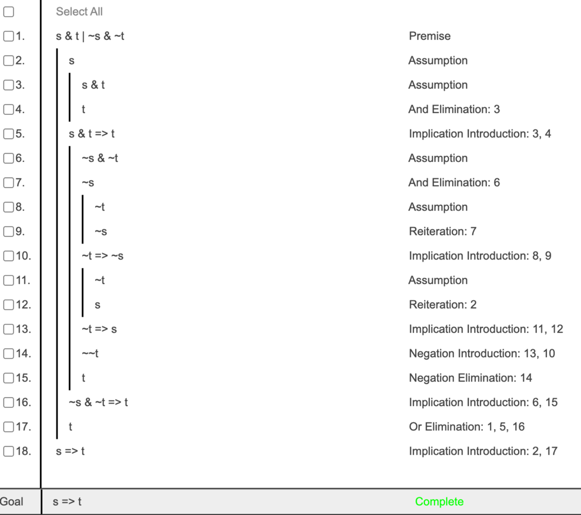

# Round 1
## Overview
This round was the first of three qualification rounds for the ILO. It covered the topics of logical validity, entailment, 
proof theory, and formal reasoning techniques. 

## Problem 1

Determine whether each logical statement is **valid** or **contingent**:

| Statement                           | Answer            |
|-------------------------------------|-------------------|
| (p ∧ ¬p) ⇒ (q ∨ r)                  | ✅ **Valid**       |
| (p ⇒ (q ⇒ r)) ⇒ ((p ⇒ q) ⇒ (q ⇒ r)) | ⚠️ **Contingent** |
| (p ∨ q) ⇒ (p ∧ q)                   | ⚠️ **Contingent** |
| (p ⇒ q) ⇒ ¬(p ⇒ ¬q)                 | ⚠️ **Contingent** |
| (p ⇒ ¬p) ∨ (¬p ⇒ p)                 | ✅ **Valid**       |

As a reminder, ```Valid``` means that the statement is true for all possible truth assignments of the variables. 
On the other hand, ```Contingent``` means that the statement is true for at least one truth assignment and false for 
at least one truth assignment of the variables.

The best way to determine whether a statement is valid or contingent is to create a truth table for the statement. 
While time-consuming, it basically guarantees that you will get the correct answer,
as well as visualizes the truth values 
which may make it easier to understand each statement. 

For this problem, these are the truth tables for each statement in descending order:

### Truth Table for (p ∧ ¬p) ⇒ (q ∨ r)

| p | q | r | ¬p | p ∧ ¬p | q ∨ r | (p ∧ ¬p) ⇒ (q ∨ r) |
|---|---|---|----|--------|-------|--------------------|
| T | T | T | F  | F      | T     | T                  |
| T | T | F | F  | F      | T     | T                  |
| T | F | T | F  | F      | T     | T                  |
| T | F | F | F  | F      | F     | T                  |
| F | T | T | T  | F      | T     | T                  |
| F | T | F | T  | F      | T     | T                  |
| F | F | T | T  | F      | T     | T                  |
| F | F | F | T  | F      | F     | T                  |

✅ **Always True → Valid**

### Truth Table for (p ⇒ (q ⇒ r)) ⇒ ((p ⇒ q) ⇒ (q ⇒ r))

| p | q | r | q ⇒ r | p ⇒ q | p ⇒ (q ⇒ r) | (p ⇒ q) ⇒ (q ⇒ r) | (p ⇒ (q ⇒ r)) ⇒ ((p ⇒ q) ⇒ (q ⇒ r)) |
|---|---|---|-------|-------|-------------|-------------------|-------------------------------------|
| 1 | 1 | 1 | 1     | 1     | 1           | 1                 | 1                                   |
| 1 | 1 | 0 | 0     | 1     | 0           | 1                 | 1                                   |
| 1 | 0 | 1 | 1     | 0     | 1           | 0                 | 1                                   |
| 1 | 0 | 0 | 1     | 0     | 1           | 1                 | 1                                   |
| 0 | 1 | 1 | 1     | 1     | 1           | 1                 | 1                                   |
| 0 | 1 | 0 | 0     | 1     | 1           | 1                 | 0                                   |
| 0 | 0 | 1 | 1     | 1     | 1           | 1                 | 1                                   |
| 0 | 0 | 0 | 1     | 1     | 1           | 1                 | 1                                   |

⚠ **Not Always True → Contingent**

### Truth Table for (p ∨ q) ⇒ (p ∧ q)

| p | q | p ∨ q | p ∧ q | (p ∨ q) ⇒ (p ∧ q) |
|---|---|-------|-------|-------------------|
| T | T | T     | T     | T                 |
| T | F | T     | F     | F                 |
| F | T | T     | F     | F                 |
| F | F | F     | F     | T                 |

⚠ **Not Always True → Contingent**

### Truth Table for (p ⇒ q) ⇒ ¬(p ⇒ ¬q)

| p | q | ¬q | p ⇒ q | p ⇒ ¬q | ¬(p ⇒ ¬q) | (p ⇒ q) ⇒ ¬(p ⇒ ¬q) |
|---|---|----|-------|--------|-----------|---------------------|
| T | T | F  | T     | F      | T         | T                   |
| T | F | T  | F     | T      | F         | T                   |
| F | T | F  | T     | T      | F         | F                   |
| F | F | T  | T     | T      | F         | F                   |

⚠ **Not Always True → Contingent**

### Truth Table for (p ⇒ ¬p) ∨ (¬p ⇒ p)

| p | ¬p | p ⇒ ¬p | ¬p ⇒ p | (p ⇒ ¬p) ∨ (¬p ⇒ p) |
|---|----|--------|--------|---------------------|
| T | F  | F      | T      | T                   |
| F | T  | T      | F      | T                   |

✅ **Always True → Valid**

## Problem 2

Determine whether each logical statement is **true** or **false**.

| Statement                                       | Answer      |
|-------------------------------------------------|-------------|
| If Γ ⊨ (φ ∨ ψ), then Γ ⊨ φ or Γ ⊨ ψ.            | ❌ **False** |
| If Γ ⊨ (φ ∧ ψ) and Γ ⊨ (φ ∧ ¬ψ), then Γ ⊨ φ.    | ✅ **True**  |
| If Γ ⊨ (φ ∨ ψ) and Γ ⊨ (φ ∨ ¬ψ), then Γ ⊨ φ.    | ✅ **True**  |
| If φ ⊨ ψ and ¬φ ⊨ ψ, then φ is unsatisfiable.   | ❌ **False** |
| If φ ⊨ ψ or ψ ⊨ φ, then φ and ψ are consistent. | ❌ **False** |

## Problem 3

For each question, select the correct multiple-choice answer.

1. Which of the following is the answer to question 2?
    - A. B
    - B. A
    - C. D
    - D. C
    - **✅ Correct Answer: D**

2. Which of the following is the answer to question 3?
    - A. C
    - B. D
    - C. B
    - D. A
    - **✅ Correct Answer: C**

3. Which of the following is the answer to question 4?
    - A. D
    - B. A
    - C. B
    - D. C
    - **✅ Correct Answer: B**

4. Which of the following is the answer to question 1?
    - A. A
    - B. B
    - C. C
    - D. D
    - **✅ Correct Answer: A**

## Problem 4

Complete the **following fitch proof** by inserting the correct logical steps:


## Problem 5
Complete the **following fitch proof** by inserting the correct logical steps:
